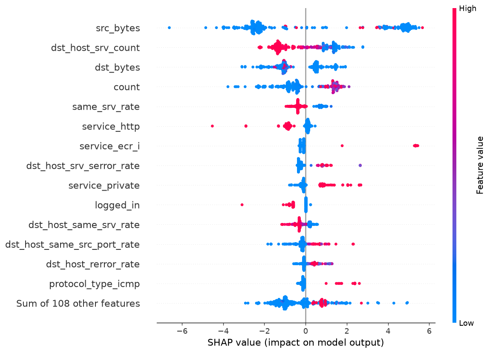
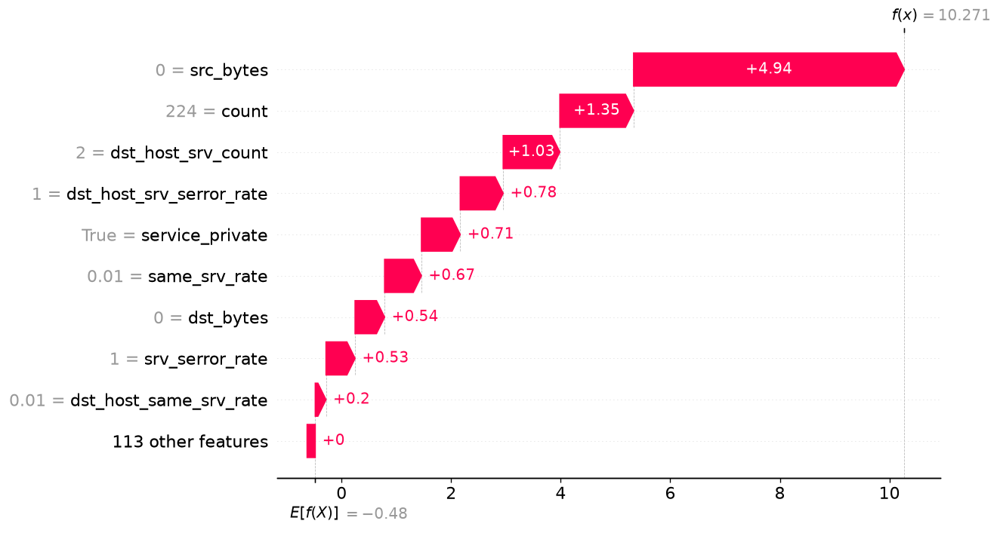

# نظام كشف تسلل شفاف على NSL-KDD

نماذج كشف تسلل (IDS) على مجموعة بيانات **NSL-KDD**، مع محاولة تجعل قرار النموذج **قابلًا للقراءة والتفسير** بالعين: شجرة قرار مُصدَّرة كنص، ترميز one-hot واضح، وأثر SHAP لكل قرار. لا يعتمد المشروع على صناديق سوداء غير مفسَّرة.

> **لغة المشروع:** Python 3.13 | **حالة البيانات:** مُختبَرة فعليًا على `KDDTest+.txt` كاملًا (22,544 سطرًا).

---

## ملفات المشروع

| الملف | الوظيفة |
|---|---|
| `requirements.txt` | المكتبات المطلوبة (7 مكتبات) |
| `download_data.py` | تنزيل `KDDTrain+.txt` و `KDDTest+.txt` من GitHub إلى `data/` |
| `train.py` | خط الأساس: Random Forest + شجرة قرار قابلة للقراءة + رسم أهمية الميزات |
| `compare_models.py` | مقارنة 4 نماذج على `KDDTest+.txt` وحفظ جدول `model_comparison.csv` |
| `explain.py` | تفسير قرارات النموذج بـ SHAP ورسم بياني عام وشرح اتصال واحد |
| `classify_attacks.py` | تصنيف إلى 5 فئات (DoS/Probe/R2L/U2R) + مصفوفة ارتباك |
| `improve_rare.py` | اختيار إعدادات النموذج بـ StratifiedKFold لتحسين الفئات النادرة + قبل/بعد |
| `download_cicids.py` | تنزيل `MachineLearningCSV.zip` من مرآة Hugging Face مع فحص الحجم وبنية الأرشيف قبل فكّه |
| `make_cicids_sample.py` | بناء عيّنة متوازنة (5,000 صف كحد أقصى لكل فئة) في `data/cicids2017/sample.csv` |
| `train_cicids.py` | تدريب `HistGradientBoostingClassifier` على العيّنة وتقسيم 70/30 + تقرير `output/cicids_report.txt` |
| `cicids_cv_and_conflicts.py` | تحقق متقاطع بـ 5 طيات + بحث تعارض التسميات + تقرير `output/cicids_cv_report.txt` |
| `analyze_bf_xss.py` | تحليل صنفَي Brute Force وXSS وحدهما في عيّنة CIC-IDS2017 + تقرير `output/bf_xss_report.txt` |
| `output/cicids_report.txt` | تقرير عيّنة CIC-IDS2017 (70/30): المقاييس وF1 لكل فئة ومصفوفة الالتباس |
| `output/cicids_cv_report.txt` | تقرير التحقق المتقاطع (5 طيات) وفحص تعارض التسميات |
| `output/cicids_sample_report.txt` | تقرير بناء العينة (يُولَّد بـ make_cicids_sample.py) |
| `output/` | كل المخرجات: تقارير، رسوم، نماذج |
| `data/` | البيانات الخام (مُستثناة من git) |

---

## طريقة التشغيل على Windows

### 0) المتطلبات
- **Python 3.13** مثبّت مع تفعيل خيار **"Add python.exe to PATH"** أثناء التثبيت.

تثبيت Python عبر `winget` (إن لم يكن مثبّتًا):
```powershell
winget install -e --id Python.Python.3.13 --scope user
```
> بعد التثبيت **افتح طرفية جديدة** حتى يُحدَّث `PATH`.

### 1) تثبيت المكتبات
```powershell
python -m pip install -r requirements.txt
```

### 2) تنزيل البيانات (~21.5 MB)
```powershell
python download_data.py
```
ينشئ `data/` ويحمّل `KDDTrain+.txt` و `KDDTest+.txt`، ويتخطّى أي ملف موجود مسبقًا.

### 3) التدريب
```powershell
python train.py
```

### 4) المقارنة والتفسير والتصنيف (اختيارية)
```powershell
python compare_models.py
python explain.py
python classify_attacks.py
```

### 5) تجربة CIC-IDS2017 (اختيارية، بعد الخطوات 1 إلى 4)

مساحة القرص المطلوبة: 884,645,759 بايت بعد فك الأرشيف + 235,102,953 بايت للأرشيف نفسه.

```powershell
python download_cicids.py
python make_cicids_sample.py
python train_cicids.py
python cicids_cv_and_conflicts.py
```

الخطوات 2) إلى 4) أعلاه تخص NSL-KDD فقط ولا علاقة لها بهذه التجربة. النتائج في قسم «CICIDS2017: تجربة على عينة صغيرة».
### ⚠️ مشكلة ترميز الطرفية (مهم على Windows)

الـ PowerShell الافتراضي في Windows يستخدم ترميز `cp1252`، فيتوقّف أي سكربت يطبع العربية بخطأ:
```
UnicodeEncodeError: 'charmap' codec can't encode characters
```

**الحل (بدون تعديل الكود):**
```powershell
$env:PYTHONUTF8=1
python classify_attacks.py
```

**حل دائم:** افتح PowerShell ← زر يمين ← Properties ← ✅ *Use Windows Terminal*، أو فعّل «Beta: Use Unicode UTF-8 for worldwide language support» في إعدادات النظام.

---

## النتائج

### 1) مقارنة النماذج (تصنيف ثنائي: عادي / هجوم)

من `output/model_comparison.csv` — مرتّبة حسب F1 لفئة الهجوم، على `KDDTest+.txt` (22,544 سطرًا):

| # | النموذج | Accuracy | Precision | Recall | **F1** | **FN** | TP | FP | TN | زمن التدريب |
|---|---|---|---|---|---|---|---|---|---|---|
| 1 | **HistGradientBoosting** | **0.8092** | 0.9700 | 0.6860 | **0.8037** | **4,029** | 8,804 | 272 | 9,439 | 2.6s |
| 2 | ExtraTrees(200) | 0.7904 | 0.9667 | 0.6543 | 0.7804 | 4,436 | 8,397 | 289 | 9,422 | 5.9s |
| 3 | RandomForest(200, balanced) | 0.7768 | 0.9685 | 0.6283 | 0.7622 | 4,770 | 8,063 | 262 | 9,449 | 5.1s |
| 4 | RandomForest(200) | 0.7677 | 0.9676 | 0.6123 | 0.7500 | 4,975 | 7,858 | 263 | 9,448 | 4.6s |

**الخلاصة:** `HistGradientBoostingClassifier` يتفوّق في **كل** المقاييس **وأسرع في التدريب** (2.6s مقابل 4.6–5.9s). إنه الخيار المعتمد في `explain.py`.

> ملاحظة: شجرة القرار في `train.py` (`max_depth=4`) حققت accuracy = **0.816** وهي أعلى دقة مطلقة، لكنها تعمّق أقل في كشف المهاجمين (recall أدنى)؛ و`output/rules.txt` يبقى ضروريًا لسبب «قابلية القراءة» لا للدقة.

**نتائج `train.py` (Random Forest, 200 شجرة):**

```
              precision    recall  f1-score   support
      normal       0.66      0.97      0.78      9711
      attack       0.97      0.61      0.75     12833
    accuracy                           0.77     22544

confusion matrix [[TN, FP], [FN, TP]]:
[[9448  263]
 [4975 7858]]
```

### 2) نتائج أنواع الهجمات (5 فئات)

من `output/attack_types_report.txt` — `HistGradientBoostingClassifier` بإعداداته الافتراضية، **accuracy الكلي = 0.7823**:

| الفئة | تدريب | اختبار | precision | recall | F1 | FN |
|---|---|---|---|---|---|---|
| normal | 67,343 | 9,711 | 0.7061 | 0.9696 | 0.8171 | 295 |
| **DoS** | 45,927 | 7,678 | 0.9633 | 0.8199 | **0.8858** | 1,383 |
| Probe | 11,656 | 2,421 | 0.7678 | 0.6473 | 0.7024 | 854 |
| **R2L** | 995 | 2,669 | 0.6647 | **0.1270** | **0.2133** | 2,330 |
| **U2R** | 52 | 65 | 0.1626 | 0.3077 | **0.2128** | 45 |

**macro-F1 = 0.5663** مقابل **weighted-F1 = 0.7550**.

**مصفوفة الارتباك (صف = الحقيقي، عمود = المتوقَّع):**

```
             normal     DoS   Probe     R2L     U2R    total
normal        9,416      75     202       6      12    9,711
DoS           1,167   6,295     215       0       1    7,678
Probe           532     163   1,567     157       2    2,421
R2L           2,183       2      57     339      88    2,669
U2R              37       0       0       8      20       65
```

**أهم نتيجة:** للنموذج **بإعداداته الافتراضية**، ‏**2,183 من 2,669** هجوم R2L صُنّفت `normal`. أي أن النموذج **يميل بهدوء لتجاهل** هجمات R2L بدل الإبلاغ عنها.

### 3) تفسير SHAP

`explain.py` يفسّر 300 اتصالاً من ملف الاختبار باستخدام `TreeExplainer` (مدعوم لنموذج `HistGradientBoosting` في `shap` 0.52.0).

أهم 5 ميزات دفعت قرار الاتصال رقم 247 نحو «هجوم» (`predict_proba(attack) = 1.0000`):

| # | الميزة | قيمة SHAP | قيمة الاتصال |
|---|---|---|---|
| 1 | `src_bytes` | **+4.9400** | 0 |
| 2 | `count` | +1.3463 | 224 |
| 3 | `dst_host_srv_count` | +1.0345 | 2 |
| 4 | `dst_host_srv_serror_rate` | +0.7836 | 1.0 |
| 5 | `service_private` | +0.7082 | True |

**التفسير:** عميل أرسل **صفر بايت** ثم أنشأ 224 اتصالًا على خادمين مع نسبة فشل خدمات عالية — نمط **فحص مسح بطيء / slow-loris**. الميزة `src_bytes` وحدها تمثل نحو 46% من مجمل الدفعة نحو «هجوم».

> ⚠️ **وحدة قيم SHAP:** هذه القيم بـ **log-odds** (وليس احتمالات). القيمة الأساسية في المثال `base = -0.4804` والقرار النهائي `sigmoid(-0.48 + 10.75) ≈ 1.0`. لا تقرأ `+4.94` كـ«94% مساهمة».

### 4) تحسين الفئات النادرة — قبل/بعد `class_weight='balanced'`

من `output/improve_rare_report.txt`. **اختيار الإعدادات تم على بيانات التدريب فقط** عبر `StratifiedKFold(n_splits=5, shuffle=True)` بمقياس macro-F1، ولم يُستخدم `KDDTest+` في أي قرار اختيار:

#### أ) نتائج التحقق المتقاطع (على التدريب فقط)

| الإعدادات | macro-F1 (CV) | الانتشار بين الطيات |
|---|---|---|
| أ) الافتراضي | 0.7997 | 0.0743 |
| **ب) `class_weight='balanced'`** | **0.9315** 🏆 | 0.0802 |
| ج) balanced + `min_samples_leaf=5` | 0.9221 | 0.0983 |

الفائز **(ب)** بفارق 0.0094 عن (ج).

#### ب) التقييم النهائي على `KDDTest+` (22,544 سطرًا)

| الفئة | دعم | precision (قبل) | recall (قبل) | F1 (قبل) | FN (قبل) | precision (بعد) | recall (بعد) | **F1 (بعد)** | FN (بعد) | **ΔF1** |
|---|---|---|---|---|---|---|---|---|---|---|
| normal | 9,711 | 0.7061 | 0.9696 | 0.8171 | 295 | 0.6990 | 0.9713 | 0.8130 | 279 | −0.0041 |
| DoS | 7,678 | 0.9633 | 0.8199 | 0.8858 | 1,383 | 0.9628 | 0.7682 | 0.8545 | 1,780 | −0.0313 |
| Probe | 2,421 | 0.7678 | 0.6473 | 0.7024 | 854 | 0.8093 | 0.7171 | **0.7604** | 685 | **+0.0580** |
| **R2L** | 2,669 | 0.6647 | 0.1270 | 0.2133 | 2,330 | 0.9662 | 0.2679 | **0.4195** | 1,954 | **+0.2062** |
| **U2R** | 65 | 0.1626 | 0.3077 | 0.2128 | 45 | 0.4500 | 0.2769 | **0.3429** | 47 | **+0.1301** |
| **macro** | 22,544 | | | 0.5663 | | | | **0.6381** | | **+0.0718** |
| **accuracy** | | | | 0.7823 | | | | **0.7895** | | **+0.0072** |

*«قبل» = الإعدادات الافتراضية، «بعد» = `class_weight='balanced'`. صف `macro` محسوب كمتوسط F1 للفئات الخمس، ويظهر في `classification_report` بالقيمة 0.6380 بسبب التقريب؛ وكلاهما من نفس الـ run.*

**مصفوفة الارتباك بعد التحسين (صف = الحقيقي، عمود = المتوقَّع):**

```
           normal      DoS    Probe     R2L      U2R      total
normal      9,432       57      212        4        6      9,711
DoS         1,588    5,898      186        3        3      7,678
Probe         498     171    1,736       15        1      2,421
R2L         1,932       0       10      715       12      2,669
U2R            43       0        1        3       18         65
```

**الخلاصة:**
- **R2L** تضاعف F1 تقريبًا (0.2133 → 0.4195) مع قفزة precision من 0.6647 إلى **0.9662**، أي كشفٌ شبه خالٍ من الإنذارات الكاذبة. لكن **recall بقي 0.2679** — أي أن 73% من هجمات R2L ما زالت تمرّ. الخلل **بنيوي** لا يُحل بالإعدادات.
- **U2R** مربح وغير رابح: precision من 0.1626 إلى 0.4500 (الإنذارات الكاذبة من 84% إلى 55%) لكن FN زاد قليلًا 45 → 47 وrecall تراجع 0.3077 → 0.2769. **انظر القيود (9):** 65 عينة اختبار لا تكفي لاستنتاج.
- **الثمن المدفوع:** DoS تراجع F1 بمقدار 0.0313 وFN من 1,383 إلى 1,780 — سلوك `balanced` المتوقع، ومقايضة مشروعة لأن DoS يبقى عند 0.8545.

---

## الشفافية

هذا هو جوهر المشروع: **لا يُقبل قرار نموذج دون تفسير يقرأه إنسان**. الرسمان التاليان ناتجان عن `explain.py` على عينة من 300 اتصال من `KDDTest+.txt`.

### الرسم العام — `output/shap_summary.png`



مخطط **beeswarm** يعرض أهم 15 ميزة عبر الـ 300 اتصال.

**كيف يُقرأ:**
- **المحور الرأسي (Y):** الميزات مرتّبة بأهميتها الشاملة عبر العينة، والأعلى = الأقوى أثرًا.
- **المحور الأفقي (X):** **قيمة SHAP**، وتُقرأ كاتجاه لا كحجم: كل نقطة **يمين الصفر** دفعت قرارها نحو **«هجوم»**، وكل نقطة **يسار الصفر** دفعته نحو **«طبيعي»**. المسافة عن الصفر هي قوة الدفعة.
- **كل نقطة = اتصال واحد** من العينة.
- **اللون:** الأزرق = قيمة الميزة منخفضة، والأحمر = مرتفعة. انظر إلى *نمط* اللون داخل الصف: نقطة حمراء يمين الصفر تعني «قيمة عالية ⟵ هجوم»، أي علاقة تعززية.
- **القراءة الأهم:** إذا كان توزيع نقطة صف واحد على الجانبين، فالميزة **غير حاسمة**؛ الصف الذي ينضغط كله على جهة واحدة هو الذي يميّز الفئتين فعليًا.

### التفسير الفردي — `output/shap_one_attack.png`



مخطط **waterfall** يشرح اتصالًا واحدًا صُنِّف هجومًا بشكل صحيح: **الصف رقم 247** في ملف الاختبار، حيث `predict_proba(attack) = 1.0000`.

**كيف يُقرأ:**
- **الشريط الأحمر (يمين):** الميزة دفعت القرار نحو «هجوم»، وطوله = حجم الدفعة.
- **الشريط الأزرق (يسار):** الميزة دفعت القرار نحو «طبيعي».
- **السهم بجوار اسم الميزة** = قيمة الميزة الفعلية في هذا الاتصال.
- **`E[f(x)]` في الأعلى:** القيمة الأساسية (base = **−0.4804**)، أي متوسط الدفعة عبر الخلفية. هذه نقطة البداية التي تُضاف إليها كل المساهمات.
- **خاصية الجمع (additive property):** مجموع قيم SHAP لكل الميزات + القيمة الأساسية = القرار النهائي بالضبط. في هذا المثال: `−0.4804 + 10.7514 = 10.2711`، و`sigmoid(10.2711) ≈ 1.0` وهو احتمال الهجوم المُبلَّغ.

**أهم 5 ميزات دفعت هذا الاتصال نحو «هجوم»:**

| # | الميزة | قيمة SHAP | قيمة الاتصال | لماذا تدفع نحو الهجوم |
|---|---|---|---|---|
| 1 | `src_bytes` | **+4.9400** | 0 | عميل أرسل صفر بايت — ليس اتصالًا تفاعليًا |
| 2 | `count` | +1.3463 | 224 | عدد هائل من الاتصالات في نافذة قصيرة |
| 3 | `dst_host_srv_count` | +1.0345 | 2 | اتصالات متكررة على خادمين محدَّدين |
| 4 | `dst_host_srv_serror_rate` | +0.7836 | 1.0 | كل الخدمات تفشل — بصمة مسح/إغراق |
| 5 | `service_private` | +0.7082 | True | خدمة داخلية غير معرَّضة كخدمة عامة |

**التفسير:** عميل أرسل **صفر بايت** ثم أنشأ 224 اتصالًا على خادمين مع نسبة فشل خدمات عالية — نمط **فحص مسح بطيء / slow-loris**. الميزة `src_bytes` وحدها تمثل نحو 46% من مجمل الدفعة (+4.94 من +10.75).

> ⚠️ **وحدة قيم SHAP:** هذه القيم بـ **log-odds** (وليس احتمالات). القيمة الأساسية في المثال `base = -0.4804` والقرار النهائي `sigmoid(-0.48 + 10.75) ≈ 1.0`. لا تقرأ `+4.94` كـ«94% مساهمة».

**قابلية القراءة ليست تجميلية:** لو رفض مُشغّل IDS قرارًا، فبإمكانه عرض الرسمين وإثبات السبب أمام مشغّل آخر — وهذا ما تعجز عنه Random Forest في `compare_models.py` كاملاً (200 شجرة لا تُلخَّص في خمس ميزات).

### 5) تحليل أخطاء R2L

من `output/r2l_error_analysis.txt` — تحليل الـ 1,932 اتصال R2L الذي صنّفها النموذج `normal` (72.4% من 2,669).

**النموذج المستخدَم في هذا التحليل:** شُغِّل هذا التحليل بواسطة `analyze_r2l_errors.py` على `HistGradientBoostingClassifier(class_weight='balanced', random_state=42)`، وهو النموذج المتوازن نفسه الذي أنتج `macro-F1 = 0.6381`.

يعرض الجدول أربعة أنواع من عشرة؛ الأنواع الستة الأخرى (imap, ftp_write, multihop, phf, xsnoop, sqlattack) في `output/r2l_error_analysis.txt`، ولذلك لا تجمع الصفوف الظاهرة إلى صف المجموع.

تعريف العمود: **ملتقطة = صُنّفت أي هجوم (وليس R2L فقط)**؛ منها **715** صُنّفت R2L و**22** صُنّفت فئة هجوم أخرى.

| نوع الهجوم | في التدريب؟ | تدريب | اختبار | ملتقطة | **فائتة** | **نسبة الفائت** |
|---|---|---|---|---|---|---|
| **`guess_passwd`** | نعم | **53** | **1,231** | 44 | **1,187** | **96.4%** |
| **`warezmaster`** | نعم | **20** | **944** | 672 | **272** | **28.8%** |
| `snmpguess` | ★ لا (جديد) | 0 | 331 | 0 | 331 | 100.0% |
| `httptunnel` | ★ لا (جديد) | 0 | 133 | 10 | 123 | 92.5% |
| **المجموع** | | **103** | **2,669** | 737 | **1,932** | **72.4%** |

**تصحيح مهم: 1,474 ليست للأنواع الجديدة.**

| مصدر الفائتة | العدد | نسبة الفائت منه |
|---|---|---|
| أنواع **موجودة في التدريب** | **1,474** | 67.0% |
| أنواع **جديدة** على النموذج | **458** | 97.4% |

فـ **76% من الفائتة (1,474 من 1,932) من أنواع رآها النموذج في التدريب**، والأنواع الجديدة تفسّر 458 فقط (23.7%). أي أن السبب **ضعف تمثيل الميزات** لا غياب بيانات الأنواع.

**المفارقة الحادة:** بين نوعين موجودين في التدريب، فشل أحدهما 96.4% والآخر 28.8% فقط — أي أن المشكلة ليست في تسمية «R2L» بل في أن كل نوع يحتاج قواعده. و`guess_passwd` انتقل من **53 عينة تدريب** إلى **1,231 في الاختبار** (نسبة 23:1)، وهي من أقل عيّنات R2L في التدريب.

**قيد على هذه الأرقام:** عيّنات `warezclient` (890 تدريب) لم تظهر إطلاقًا في جدول أنواع R2L بالاختبار، لذا لا يمكن المقارنة بين كل الأنواع. وأرقام الأنواع الأصغر من 10 عيّنات اختبار (`xsnoop`=4، `sqlattack`=2، `imap`=1، `phf`=2) **غير ذات دلالة إحصائية** مثل U2R تمامًا.

---

## المخرجات

| الملف | المحتوى |
|---|---|
| `output/attack_types_report.txt` | تقرير 5 فئات كامل (نص) |
| `output/attack_types_confusion.png` | خريطة حرارية لمصفوفة الارتباك (مقياس لوغاريتمي) |
| `output/model_comparison.csv` | جدول مقارنة 4 نماذج |
| `output/shap_summary.png` | مخطط SHAP beeswarm لأهم 15 ميزة |
| `output/shap_one_attack.png` | مخطط waterfall لتفسير اتصال واحد |
| `output/improve_rare_report.txt` | تقرير التحقق المتقاطع + مقارنة قبل/بعد `balanced` |
| `output/rules.txt` | قواعد شجرة القرار بنص مقروء |
| `output/feature_importance.png` | أهمية ميزات Random Forest |
| `output/ids_model.joblib` | نموذج الغابة المُدرَّب (18.8 MB) — (يُولَّد محلياً ولا يُرفع إلى GitHub) |
| `output/best_model.joblib` | HistGradientBoosting (396 KB) — (يُولَّد محلياً ولا يُرفع إلى GitHub) |
| `output/shap_r2l_missed_vs_caught.png` | مقارنة SHAP بين هجمات R2L الفائتة والملتقطة |
| `output/bf_xss_report.txt` | تقرير تحليل الخلط بين Brute Force وXSS (يُولَّد بـ analyze_bf_xss.py) |

---

## CICIDS2017: تجربة على عينة صغيرة

> تجربة ثانية على مجموعة أحدث من NSL-KDD. النتائج هنا على **عينة** مصطنعة التوازن، فاقرأ قسم «ما نعرفه وما لا نعرفه» قبل أي مقارنة.

### المصدر
- المجموعة: CICIDS2017 (ملفات CSV الجاهزة `MachineLearningCSV`، ثمانية ملفات، نحو 2.83 مليون تدفق بعد التنظيف، 15 فئة: BENIGN و14 نوع هجوم).
- المصدر المستخدم **نسخة غير رسمية** على Hugging Face (`bencorn/CICIDS2017`)، لأن صفحة التنزيل الرسمية تطلب تعبئة نموذج ببيانات شخصية.
- ما يتحقق منه `download_cicids.py`: الحجم (235,102,953 بايت)، وسلامة بنية الأرشيف (ملفات CSV فقط ومسارات داخل المجلد الهدف) قبل الفك. بصمة SHA256 للملف الذي استخدمناه: `c3f26274b36c837ccf28ffd2dbf4582941c30b3ee70a635c6e5b2f87c4727928`.
- تنبيه: فحص الحجم يكشف التلف لا التلاعب، والبصمة محسوبة من الملف نفسه فلا تثبت المصدر. إثبات المصدر يلزمه مرجع خارجي موثوق (توقيع رقمي أو بصمة معلنة من الناشر). استخدم هذه النسخة للبحث والتعلم لا كمدخل حاسم.

### إعادة الإنتاج
1. `pip install -r requirements.txt`
2. `python download_cicids.py`
3. `python make_cicids_sample.py`
4. `python train_cicids.py`
5. `python cicids_cv_and_conflicts.py`

### كيف بُنيت العينة
| الخطوة | التفصيل |
|---|---|
| القراءة والتنظيف | 2,830,743 صفًا مقروءًا. حُذف 2,867 (0.10%) بسبب NaN أو inf فبقي 2,827,876 |
| توحيد التسميات | ثلاث تسميات Web Attack فيها حرف تالف (U+FFFD) استُبدل بشرطة عادية |
| العينة | كل صفوف الفئات التي عددها أقل من 5,000، و5,000 عشوائيًا كحد أقصى لكل فئة أخرى (`random_state=42`): 49,183 صفًا (1.74% من المجموع) في 15 فئة |
| حذف المكرر | حُذف 5,560 صفًا (11.30%) فبقي 43,623. التكرار كان في الفئات الكبيرة (مثل SSH-Patator: 2,263 من 5,000) والفئات الصغيرة لم تتأثر |
| العمود المكرر | `Fwd Header Length.1` مطابق للعمود `Fwd Header Length` في 100% من الصفوف فحُذف، فالميزات 77 |

التقرير الكامل لمرحلة التنظيف وأخذ العينة (عدد الصفوف المقروءة والمحذوفة والمحتفَظ بها لكل فئة) محفوظ في [output/cicids_sample_report.txt](output/cicids_sample_report.txt)، ويُعاد توليده بتشغيل `python make_cicids_sample.py`.

### النتائج
النموذج: HistGradientBoostingClassifier مع `class_weight='balanced'` و`random_state=42`.

| القياس | قسمة 70/30 | 5 طيات (تنبؤات مجمّعة) |
|---|---|---|
| accuracy | 0.9774 | 0.9805 |
| macro-F1 | 0.8905 | 0.9290 |
| weighted-F1 | 0.9779 | 0.9811 |

- macro-F1 لكل طية: 0.9284 ± 0.0123 (المدى 0.9173 – 0.9524، الانحراف بحساب ddof=0). هذا هو الرقم الذي نعتمده.
- الفرق 0.0385 بين القياسين ناتج في معظمه عن الفئات الثلاث الصغيرة: اختبار 70/30 لم يحتوِ إلا على 3 عينات Heartbleed و11 Infiltration و6 SQL Injection.

| الفئة | دعم 70/30 | F1 70/30 | دعم 5 طيات | F1 خارج الطية | متوسط الطيات | الانحراف | الأدنى | الأعلى | الفرق |
|---|---|---|---|---|---|---|---|---|---|
| BENIGN | 1,469 | 0.9963 | 4,895 | 0.9981 | 0.9981 | 0.0010 | 0.9969 | 0.9995 | +0.0018 |
| Bot | 584 | 0.9991 | 1,948 | 0.9982 | 0.9982 | 0.0017 | 0.9949 | 1.0000 | -0.0009 |
| DDoS | 1,500 | 0.9990 | 5,000 | 0.9996 | 0.9996 | 0.0004 | 0.9990 | 1.0000 | +0.0006 |
| DoS GoldenEye | 1,499 | 0.9970 | 4,998 | 0.9974 | 0.9974 | 0.0007 | 0.9965 | 0.9985 | +0.0004 |
| DoS Hulk | 1,124 | 0.9951 | 3,745 | 0.9968 | 0.9968 | 0.0015 | 0.9947 | 0.9987 | +0.0017 |
| DoS Slowhttptest | 1,425 | 0.9909 | 4,749 | 0.9946 | 0.9946 | 0.0021 | 0.9915 | 0.9979 | +0.0037 |
| DoS slowloris | 1,397 | 0.9904 | 4,656 | 0.9945 | 0.9945 | 0.0028 | 0.9898 | 0.9979 | +0.0041 |
| FTP-Patator | 1,155 | 1.0000 | 3,851 | 0.9997 | 0.9997 | 0.0005 | 0.9987 | 1.0000 | -0.0003 |
| Heartbleed | 3 | 0.8571 | 11 | 1.0000 | 1.0000 | 0.0000 | 1.0000 | 1.0000 | +0.1429 |
| Infiltration | 11 | 0.7778 | 36 | 0.9565 | 0.9513 | 0.0661 | 0.8333 | 1.0000 | +0.1787 |
| PortScan | 1,456 | 0.9986 | 4,854 | 0.9984 | 0.9983 | 0.0010 | 0.9969 | 1.0000 | -0.0002 |
| SSH-Patator | 821 | 0.9988 | 2,737 | 0.9993 | 0.9993 | 0.0011 | 0.9973 | 1.0000 | +0.0005 |
| Web Attack - Brute Force | 441 | 0.7052 | 1,470 | 0.7285 | 0.7269 | 0.0379 | 0.6769 | 0.7690 | +0.0233 |
| Web Attack - Sql Injection | 6 | 0.6000 | 21 | 0.7619 | 0.7581 | 0.1484 | 0.6000 | 1.0000 | +0.1619 |
| Web Attack - XSS | 196 | 0.4529 | 652 | 0.5122 | 0.5129 | 0.0156 | 0.4969 | 0.5411 | +0.0593 |

### ما نعرفه وما لا نعرفه
- **ضعف مستقر في Web Attack:** XSS وBrute Force الأضعف بفارق كبير، بأعداد عينات كافية ونتيجة مستقرة بين الطيات. في اختبار 70/30 صُنّفت 147 عينة من Brute Force على أنها XSS، و92 من XSS على أنها Brute Force، أي **147 + 92 = 239** من الالتباس المتبادل بين الفئتين. أما **296** فهو مجموع أخطاء الاختبار كله في كل الفئات الخمس عشرة، لا هاتين الفئتين وحدهما.
- **لا تعارض تام في التسميات:** لا توجد أي مجموعة صفوف ميزاتها متطابقة وتسمياتها مختلفة (0 مجموعات في 43,623 صفًا). هذا لا يثبت أن التسميات صحيحة ولا أن الفئتين قابلتان للفصل.
- **سبب الخلط غير معروف:** فرضيتان لم نختبرهما: تشابه حقيقي في خصائص التدفق بين الهجومين، أو أخطاء في التسميات مع فروق طفيفة في الميزات. أي تفسير آخر تخمين.
- **الفئات الصغيرة غير موثوقة إحصائيًا:** Heartbleed (11 عينة) وInfiltration (36) وSQL Injection (21). خطأ واحد يغيّر F1 كثيرًا، والانحراف بين الطيات 0.0661 لـ Infiltration و0.1484 لـ SQL Injection. F1 = 1.0 لـ Heartbleed على 11 عينة لا يعني أن المشكلة محلولة.
- **العينة مصطنعة التوازن:** BENIGN نحو 11% منها بعد حذف المكرر (4,895 من 43,623) بينما هو الغالبية الساحقة في الشبكات الحقيقية، فلا يمكن استنتاج معدل إنذارات كاذبة حقيقي من هذه الأرقام.
- **القسمة عشوائية من عينة واحدة:** قد تقع تدفقات متجاورة من الهجوم نفسه في التدريب والاختبار معًا، فالأرقام متفائلة.
- **لا تقارن هذه الأرقام مع 0.6381 (NSL-KDD):** المجموعتان مختلفتان، وبروتوكول التقييم مختلف (هناك اختبار رسمي منفصل فيه هجمات جديدة، وهنا قسمة عشوائية)، وتوازن الفئات مختلف.
- **مشكلات معروفة في CICIDS2017 نفسها:** تناولت أبحاث منشورة أخطاءً ومشكلات في هذه المجموعة (المراجع أدناه). لم نعتمد على هذين البحثين في أي رقم هنا، وهما مرجعان لوجود المشكلات فقط.

### تحليل الخلط بين Brute Force وXSS

هذا القسم يفصل الصنفين وحدهما ليقيس مقدار الخلط بينهما بدقة، بدل قراءة الخلط من جدول الفئات الخمس عشرة. المصدر الوحيد لكل رقم فيه هو `output/bf_xss_report.txt`، والسكربت الذي أنتجه هو `analyze_bf_xss.py`.

**الطريقة**

- مصنّف ثنائي على الصنفين `Web Attack - Brute Force` و `Web Attack - XSS` فقط، وهو `HistGradientBoostingClassifier(class_weight='balanced')` ببذرة 42، و77 ميزة.
- تحقق `StratifiedKFold` من 5 طيّات مع `shuffle=True`. النتائج أدناه محسوبة من تنبؤات خارج العيّنة مجمَّعةً من الطيّات الخمس، لا من طيّة واحدة.
- بعد ذلك قياس أقرب جار: `StandardScaler` يُضبط على بيانات التدريب داخل كل طيّة، ثم `NearestNeighbors` يُبنى على صف التدريب ويُستعلم منه صف الاختبار فقط. فلا يدخل صف الاختبار في مجموعة المرشّحين.
- يعمل التحليل على 1,470 صفاً Brute Force و652 صفاً XSS، أي 2,122 صفاً بعد حذف الصفوف المكررة.

**النتائج**

| القياس | القيمة |
|---|---|
| macro-F1 الثنائي للفئتين معاً | 0.6120 |
| F1 لـ Brute Force | 0.7309 |
| F1 لـ XSS | 0.4932 |
| دقة_accuracy | 0.6484 |
| أقرب جار من الصنف الآخر — Brute Force | 363 من 1,470 أي 24.69% |
| نسبة الصدفة المتوقعة — Brute Force | 30.73% |
| أقرب جار من الصنف الآخر — XSS | 375 من 652 أي 57.52% |
| نسبة الصدفة المتوقعة — XSS | 69.27% |
| متوسط المسافة إلى أقرب عينة من نفس الصنف — Brute Force | 0.1811 |
| متوسط المسافة إلى أقرب عينة من الصنف الآخر — Brute Force | 1.3628 |
| متوسط المسافة إلى أقرب عينة من نفس الصنف — XSS | 0.5652 |
| متوسط المسافة إلى أقرب عينة من الصنف الآخر — XSS | 1.0996 |
| أعلى قيمة مطلقة لـ Cohen's d عبر الـ49 ميزة التي يمكن حساب d لها (الميزة Down/Up Ratio) | 0.3975 |

**ما تُظهره الأرقام**

- **الخلط يظهر حتى في مهمة ثنائية.** فحصر المهمة في الصنفين وحدهما لا يزيل الخلط: صُنِّفت 457 عينة من Brute Force على أنها XSS، و 289 من XSS على أنها Brute Force، مقابل 1,013 و 363 صُنِّفتا صواباً. أي أن `macro-F1 = 0.6120` و `accuracy = 0.6484` على فئتين لا أكثر.
- **ولا تميّز ميزة واحدة الفئتين تميّزاً واضحاً.** متوسط القيمة المطلقة لـ Cohen's d عبر الـ49 ميزة التي يمكن حساب d لها هو 0.136530، وأعلاها 0.3975 فقط (الميزة `Down/Up Ratio`). أما الـ28 ميزة المتبقية من أصل الـ77 فقيمة d لها غير معرّفة (انحرافها المشترك صفر)، فاستُثنيت من المتوسط ولم تُحسب أصفاراً.
- **أقرب جار من الصنف الآخر أقل من نسبة الصدفة في الحالتين.** 24.69% عند Brute Force و 57.52% عند XSS، مقابل 30.73% و 69.27% لو كان الجوار عشوائياً. والقيمتان بعيدتان عن الصفر، أي أن التداخل جزئي لا كامل.
- **أقرب عينة من نفس الصنف أبعد عند XSS.** متوسط المسافة إلى أقرب عينة من نفس الصنف 0.5652 عند XSS مقابل 0.1811 عند Brute Force. هذا يتسق مع تشتت أكبر داخل XSS، لكنه يتأثر أيضاً بصغر عدد عينات XSS (652 مقابل 1,470)، فلا يُثبت التشتت وحده. ولا نقارن متوسطَي المسافة إلى الصنف الآخر (1.3628 و1.0996) بين الصنفين، لأن عدد المرشحين في الصنف الآخر يختلف (652 مقابل 1,470).

**ما لا تُثبته الأرقام**

- **صحّة التسميات: فرضية مفتوحة لا يحسمها هذا التقرير.** القياسات أُجريت على التسميات كما وردت في المصدر. التقرير يُظهر 0 صفوف متطابقة تماماً في الميزات بين الصنفين، وهذا ينفي التعارض التام فحسب. فلا دليل فيه على أي من الاحتمالات: تسميتان صحيحتان، أو تسميتان متداخلتان في المصدر، أو خصائص تدفّق متشابهة فعلاً بين الهجومين.
- **زمن التدريب ليس رقماً ثابتاً.** عمود الزمن في التقرير قياس زمني حائطيّ، فقد يختلف بين تشغيلين على البيانات نفسها. لذلك لا يُدرَج ضمن أرقام النتائج ولا يُقارن.
- **نسب الصدفة تقديرية.** القيمتان 30.73% و 69.27% مشتقّتان من نصيب حجم الصنف الآخر في المجموع، لا من قياس على المسافات، وليست احتمالاً مقيساً.
- **العينة مُزالة التكرار وليست المجموعة كاملة.** الأرقام أعلاه على 2,122 صفاً من أصل 2,159 صفاً للصفين، بعد حذف 37 صفاً مكرّراً. وهي جزء من العيّنة المقتطعة الموصوفة في جدول «كيف بُنيت العينة»: صفوف مختارة من المجموعة الأصلية وسقف لعدد صفوف كل فئة، لا بيانات مولَّدة ولا محاكاة. لا تمثّل CIC-IDS2017 كاملة ولا تصلح لمقارنة مباشرة مع نتائج NSL-KDD.

### المراجع
- Engelen, Rimmer, Joosen (2021). [Troubleshooting an Intrusion Detection Dataset: the CICIDS2017 Case Study](https://imec-publications.be/entities/publication/de3203e3-50c3-4fc3-b93e-065b1bf16765).
- [Errors in the CICIDS2017 dataset and the significant differences in detection performances it makes](https://hal.archives-ouvertes.fr/hal-03775466) (HAL).

---

## القيود

### 1) ‏`KDDTest+.txt` يحتوي هجمات غير موجودة في التدريب
هذا **مقصود في تصميم** NSL-KDD: الاختبار يقيس **التعميم على هجمات جديدة**، لا على إعادة sightings نفس الأنواع. النتائج السابقة يجب قراءتها في هذا الضوئية، فلا تُفسَّر كـ«خطأ برمجي».

### 2) ‏R2L ضعيفة جدًا: recall = 0.1270 (افتراضي) و0.2679 (بعد balanced)
للنموذج **بإعداداته الافتراضية** يبلغ `recall = 0.1270`: أي **339 مُلتقطة من 2,669**، و**2,183 من 2,669 صُنّفت `normal`**. وبعد `class_weight='balanced'` يصبح `recall = 0.2679`: أي **715 مُلتقطة**، و**1,932 صُنّفت `normal`** — وهو أيضاً ضعيف. المصدر: `output/improve_rare_report.txt`. والسبب أساسي لا تجميلي: **995 عينة تدريب مقابل 2,669 عينة اختبار** — النموذج لم يرَ سوى ثلث ما سيُختبر.

### 3) ‏U2R ضعيفة: 52 عينة تدريب فقط
فئة U2R غير قابلة للتعلّم الموثوق من 52 مثالًا، لذا **precision = 0.1626** أي أن 84% من تنبيهات U2R إنذارات كاذبة.

### 4) ‏الخلط الثنائي يُخفي الضعف
تصنيف «عادي/هجوم» يعطي F1 = 0.8037 يبدو جيدًا، لكنه مضلّل: ‏**~70% من «الهجمات» هي DoS** الذي يميّزه `src_bytes = 0` بسهولة تافهة. الفارق بين `weighted-F1` (**0.7550**) و `macro-F1` (**0.5663**) للنموذج **بإعداداته الافتراضية** هو بالضبط حجم هذا التضليل. **التصنيف الثنائي ليس مؤشرًا على جودة الـ IDS.**

### 5) ‏.skew في التدريب لا يعكس الواقع
DoS يشكّل 78.3% من التدريب لكن 59.8% فقط من الاختبار، وR2L يشكّل 1.7% من التدريب و20.8% من الاختبار — توزيعان مختلفان جوهريًا.

### 6) ‏SHAP على HGB يُعيد log-odds
لا يمكن تفسير قيم SHAP مباشرةً كاحتمالات (انظر أعلاه). للحصول على احتمالات:
```python
shap.explainers.other.Tree(model).shap_values(X, from_call=False,
                                              model_output="probability")
```

### 7) ‏NSL-KDD قديمة
مبنية على بيانات KDD'99 (1999) وشبكات من Commitment-era. أنماط الهجمات فيها لا تمثّل تهديدات اليوم (لا ransomware، لا C2 حديث، لا تحليل سلوكي). مفيدة للتعليم والشفافية، **غير صالحة كتقدير لأداء IDS في الإنتاج**.

### 8) ‏فجوة كبيرة بين التحقق المتقاطع والاختبار الحقيقي
هذه أخطر نقطة في المشروع، ولا يجوز إغفالها:

| القياس | القيمة |
|---|---|
| macro-F1 من التحقق المتقاطع (على التدريب) | **0.9315** |
| macro-F1 الحقيقي على `KDDTest+` | **0.6381** |
| **الفجوة** | **0.2934** |

**السبب — عاملان معًا، لا سبب واحد:** طيّات `StratifiedKFold` تأخذ من **نفس توزيع** `KDDTrain+.txt` الذي رآه النموذج بالفعل، فـ DoS يشكّل 78.3% من كل طيّة. و`KDDTest+.txt` يكسر هذا التوقّع بوسيلتين في آن واحد:

1. **أنواع هجمات جديدة** لم تظهر في التدريب (مثل `httptunnel` و`xterm` و`xsnoop` و`sqlattack` و`saint`، إضافة إلى 10 أنواع أخرى).
2. **انقلاب في توزيع الأنواع** بين التدريب والاختبار، حتى للأنواع المشتركة.

**هذا العامل الثاني ليس افتراضًا:** تحليل أخطاء R2L (انظر النتيجة 5) أظهر أن الأنواع الجديدة وحدها **لا تفسّر الفجوة**. فبين 1,932 فاتتة في R2L:

| مصدر الفائتة | العدد | نسبته من الفاتتة | نسبة الفائت من نوعه |
|---|---|---|---|
| أنواع **موجودة في التدريب** | **1,474** | 76.3% | 67.0% |
| أنواع **جديدة** | **458** | **23.7%** | 97.4% |

أي أن الأنواع الجديدة تفسّر **458 فقط** (23.7%)، و**الباقي (1,474) من أنواع رآها النموذج بالفعل في التدريب**. والسبب قابل للقياس: `guess_passwd` موجود في التدريب بـ **53** عينة، لكنه يمثّل **1,231** عينة في الاختبار؛ و`warezmaster` العكس تمامًا (20 تدريب مقابل 944 اختبار). فالنموذج رأى النوعين فعلًا، لكنه رأهما بتوزيع لا يشبه ما سيُختبر.

**الخلاصة:** الفجوة ليست «هجمات جديدة» فحسب، وليست «ضعف تمثيل» فحسب، بل **مجموعهما**: غياب أنواع + انقلاب أوزانها بين الملفين.

**الخلاصة العملية:** أي رقم قادم من التحقق المتقاطع على هذا المشروع **مبالغ في التفاؤل ولا يصلح لتقدير أداء نشر**. وهو سليم **لمقارنة الإعدادات** فقط، لأن الإعدادات الثلاثة تُقيَّم على نفس الطيّات. **لا تستخدم 0.93 في أي عرض تقديمي على أنه أداء النموذج.**

### 9) ‏U2R: 65 عينة اختبار فقط، فلا يُعتد بفروقها
جدول «قبل/بعد» يعرض أن FN في U2R تحسّن أو تدهور بمقدار **عينتين فقط** (45 → 47). مع **65 عينة اختبار**، هاتان العينتان تعنيان انحرافًا بنسبة **3%** — أي **أقل من ضجيج المعاينة**، فلا معنى إحصائيًا.

**لا يُعتد بأي رقم من صف U2R في هذا التقرير** بما فيه F1 = 0.3429 وprecision = 0.4500. تغيّر F1 بـ `+0.1301` يبدو مثيرًا، لكنه ناتج عن عدد قليل من الحالات لا عن تحسّن حقيقي. **التصريح الآمن:** حالة U2R **غير مقيَّمة بشكل موثوق**، وتقييمها يحتاج مجموعات بيانات أكبر بكثير مما يوفّره NSL-KDD. أي قرار إنتاجي حولها غير مسؤول استنادًا إلى هذا التقرير.

**لهذا السبب** لا يغطي `improve_rare.py` بنية الفئات النادرة (SMOTE، أو توليد عيّنات اصطناعية، أو `sample_weight` متدرّج): التحسين هنا يأتي من بيانات لا من هندسة المعاملات.

---

## الترخيص والمصدر

- البيانات: [NSL-KDD](https://github.com/defcom17/NSL_KDD) (تنزيل مباشر عبر `download_data.py`).
- الكود مرفوع إلى `https://github.com/ObitoUchiha930/transparent-ids-nsl-kdd` (الفرع `main`).
- مجموعات البيانات (`data/`) والنماذج المدربة (`output/*.joblib`) **غير مرفوعة** لتجاوز حجم المستودع؛ وُلّدت محليًا عبر السكربتات.
- البريد المستخدم في الـ commit هو `users.noreply.github.com`، وهو بريد GitHub الرسمي الذي لا يستقبل رسائل.
